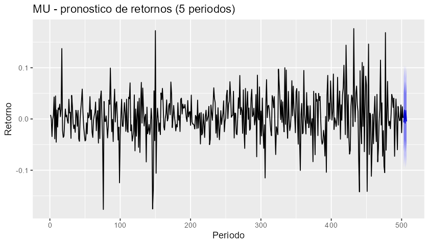

# Examen parcial - Parte Practica

**Gerencia de Riesgos Financieros**
**Instrumento: Micron Technology (MU)**

## Setup

```r
if (!require("pacman")) install.packages("pacman")
pacman::p_load(quantmod, tseries, aTSA, forecast, lmtest, ggplot2, FinTS)
options(scipen = 999)
```

## Descarga de precios y calculo de retornos

```r
mu_xts <- getSymbols("MU", src = "yahoo",
                      from = "2024-08-31", to = "2026-09-04",
                      auto.assign = FALSE)
precio <- Ad(mu_xts)
colnames(precio) <- "MU"

autoplot(precio) +
  labs(title = "MU - precio de cierre ajustado", x = "Fecha", y = "USD")

retorno <- na.omit(diff(log(precio)))

autoplot(retorno) +
  labs(title = "MU - retorno continuo diario", x = "Fecha", y = "Retorno")

# Retornos oscilan alrededor de cero, sin tendencia -> ya estacionarios.
```

## 1. Estadisticas descriptivas de los retornos

```r
media   <- mean(retorno) #EL retonro promedio diario es de 0,475%
desv    <- sd(retorno) #La volatilidad diaria es de 4,5% diario
minimo  <- min(retorno)  #La peor caida en un día fue de 17,65%
maximo  <- max(retorno)   #La mejor subida en un día fue de 17,64$
mediana <- median(retorno)   #La mediana es de 0,345%

c(media = media, sd = desv, min = minimo, max = maximo, mediana = mediana)
```

```
       media           sd          min          max      mediana
 0.004755733  0.045021605 -0.176486734  0.176400829  0.003458632
```

## 2. Raices unitarias sobre el precio

```r
precio_num <- as.numeric(precio)

#Hacemos las pruebas de estacionariedad sobre la serie original:

#H0 = Hay raíz unitaria (no hay estacionariedad)
#H1 = No hay raíz unitaria (hay estacionariedad)

adf.test(precio_num)
pp.test(precio_num)

#Ya ADF y PP son suficientes, no rechazan H0, es decir hay raíz unitaria (no es
#no es estacionaria)

#kpss.test(precio_num, lag.short = FALSE) / solo la aplicamos si adf y pp se
#contradicen

#Procedemos con la primera diferenciación, y realizamos de nuevo las pruebas:
precio_diff <- diff(precio_num)

adf.test(precio_diff)
pp.test(precio_diff)

#Ambas coinciden y rechazan H0, ya la serie es estacionaria con d=1
```

```
Augmented Dickey-Fuller Test
alternative: stationary

Type 1: no drift no trend
     lag  ADF p.value
[1,]   0 1.14   0.932
[2,]   1 1.37   0.956
[3,]   2 1.75   0.980
[4,]   3 1.23   0.943
[5,]   4 1.40   0.959
[6,]   5 1.66   0.976
Type 2: with drift no trend
     lag   ADF p.value
[1,]   0 0.105   0.964
[2,]   1 0.290   0.977
[3,]   2 0.586   0.989
[4,]   3 0.179   0.970
[5,]   4 0.318   0.978
[6,]   5 0.523   0.986
Type 3: with drift and trend
     lag   ADF p.value
[1,]   0 -1.76   0.678
[2,]   1 -1.61   0.742
[3,]   2 -1.40   0.832
[4,]   3 -1.68   0.712
[5,]   4 -1.57   0.760
[6,]   5 -1.42   0.822

Phillips-Perron Unit Root Test
alternative: stationary

Type 1: no drift no trend
 lag Z_rho p.value
   5  1.75    0.98
Type 2: with drift no trend
 lag Z_rho p.value
   5 0.619    0.98
Type 3: with drift and trend
 lag Z_rho p.value
   5 -4.88   0.816

Augmented Dickey-Fuller Test (serie diferenciada, d=1)
alternative: stationary

Type 1: no drift no trend
     lag   ADF p.value
[1,]   0 -24.4    0.01
[2,]   1 -19.0    0.01
[3,]   2 -11.8    0.01
[4,]   3 -11.1    0.01
[5,]   4 -10.9    0.01
[6,]   5 -10.8    0.01
Type 2: with drift no trend
     lag   ADF p.value
[1,]   0 -24.5    0.01
[2,]   1 -19.1    0.01
[3,]   2 -11.9    0.01
[4,]   3 -11.3    0.01
[5,]   4 -11.1    0.01
[6,]   5 -11.0    0.01
Type 3: with drift and trend
     lag   ADF p.value
[1,]   0 -24.5    0.01
[2,]   1 -19.2    0.01
[3,]   2 -12.0    0.01
[4,]   3 -11.4    0.01
[5,]   4 -11.2    0.01
[6,]   5 -11.2    0.01

Phillips-Perron Unit Root Test (serie diferenciada, d=1)
alternative: stationary

Type 1: no drift no trend
 lag Z_rho p.value
   5  -524    0.01
Type 2: with drift no trend
 lag Z_rho p.value
   5  -522    0.01
Type 3: with drift and trend
 lag Z_rho p.value
   5  -520    0.01
```

## 3. Modelo ARIMA sobre los retornos

```r
r <- as.numeric(retorno)
modelo <- auto.arima(r, stepwise = FALSE)
modelo
coeftest(modelo)

#a. todos los coeficientes son significativos con un nivel de significancia del 10%
#b. Se necesitaron 2 rezagos de la parte autoregresiva, es decir retornos de sus propios
#   dos valores pasados y 2 rezagos dela parte de media movil, es decir, errores de los
#   ultimos 2 periodos.
```

```
Series: r
ARIMA(2,0,2) with non-zero mean

Coefficients:
          ar1      ar2     ma1     ma2    mean
      -1.8366  -0.9360  1.8743  0.9565  0.0047
s.e.   0.0363   0.0422  0.0280  0.0306  0.0020

sigma^2 = 0.001987:  log likelihood = 851.47
AIC=-1690.93   AICc=-1690.76   BIC=-1665.62

z test of coefficients:

            Estimate Std. Error  z value             Pr(>|z|)
ar1       -1.8365908  0.0362866 -50.6086 < 0.0000000000000002 ***
ar2       -0.9359737  0.0421684 -22.1985 < 0.0000000000000002 ***
ma1        1.8742768  0.0280397  66.8580 < 0.0000000000000002 ***
ma2        0.9564557  0.0305720  31.2887 < 0.0000000000000002 ***
intercept  0.0047407  0.0019897   2.3826              0.01719 *
---
Signif. codes:  0 '***' 0.001 '**' 0.01 '*' 0.05 '.' 0.1 ' ' 1
```

## 4. Validacion de supuestos del modelo

```r
res <- residuals(modelo)

#Media cero (se cumple)
t.test(res)

#No autocorrelación (se cumple)
Box.test(res, lag = 10, type = "Ljung-Box")

#Homocedasticidad (no se cumple) -> Se aplica GARCH en escenarios de heterocedasticidad
Box.test(res^2, lag = 10, type = "Ljung-Box")
FinTS::ArchTest(res, lags = 10)

#normalidad (no se cumple) -> Es deseable que sea normal por facilidad de interpretación
#pero no daña el modelo.
jarque.bera.test(res)
```

```
	One Sample t-test

data:  res
t = 0.0066306, df = 501, p-value = 0.9947
95 percent confidence interval:
 -0.003879620  0.003905895
sample estimates:
    mean of x
0.00001313737


	Box-Ljung test

data:  res
X-squared = 9.508, df = 10, p-value = 0.4847


	Box-Ljung test

data:  res^2
X-squared = 43.848, df = 10, p-value = 0.000003506


	ARCH LM-test; Null hypothesis: no ARCH effects

data:  res
Chi-squared = 29.051, df = 10, p-value = 0.001223


	Jarque Bera Test

data:  res
X-squared = 78.702, df = 2, p-value < 0.00000000000000022
```

## 5. Pronostico de los siguientes 5 periodos

```r
pron <- forecast(modelo, h = 5)
pron

autoplot(pron) +
  labs(title = "MU - pronostico de retornos (5 periodos)", x = "Periodo", y = "Retorno")
#INTERPRETACIÓN 1ER pronóstico: Se pronóstica que en el periodo 503 el retorno sea de -0,65%
#Con un nivel de confianza del 95% se estima que el rango máximo y mínimo esté entre
#esté entre +8,09% y -9,38%.
```



```
    Point Forecast       Lo 80      Hi 80       Lo 95      Hi 95
503   -0.006458565 -0.06357847 0.05066134 -0.09381592 0.08089879
504    0.017421194 -0.03973971 0.07458210 -0.06999887 0.10484125
505   -0.008097928 -0.06532693 0.04913107 -0.09562214 0.07942628
506    0.016420727 -0.04089217 0.07373362 -0.07123178 0.10407323
507   -0.004727113 -0.06212275 0.05266853 -0.09250617 0.08305194
```
